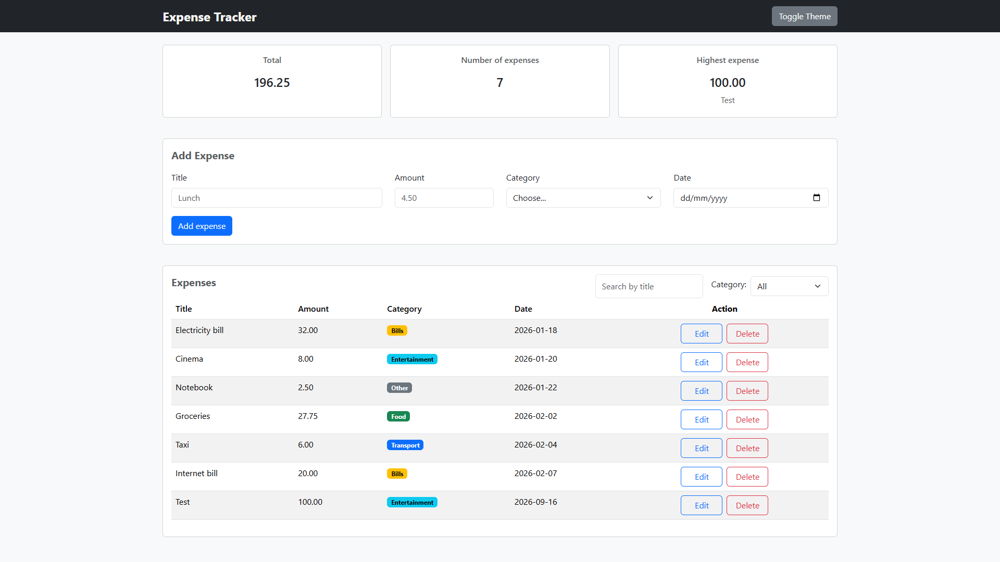
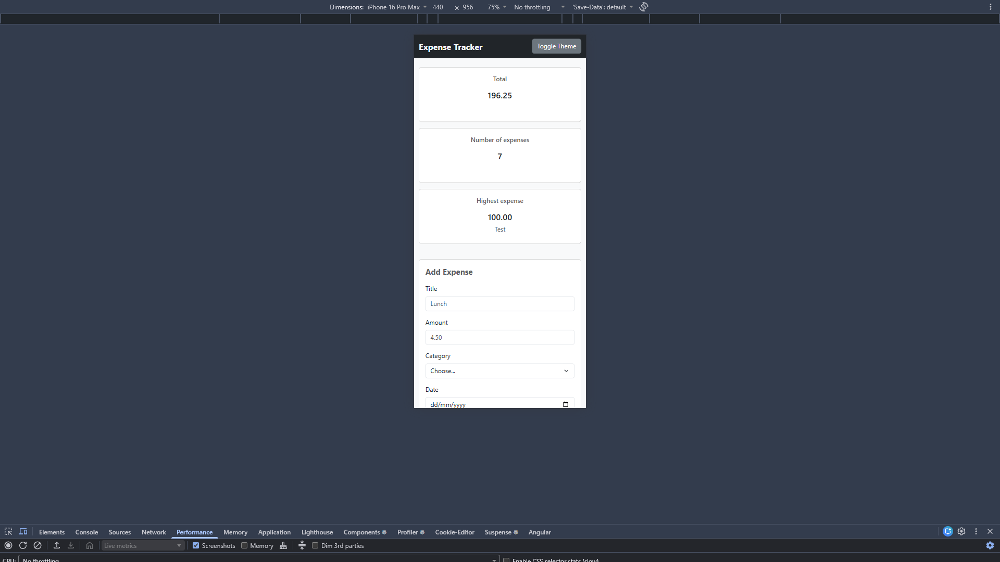

# Expense Tracker

A full-stack expense tracker with a Bootstrap frontend, an Express REST API, and PostgreSQL persistence. The interface supports creating, editing, deleting, searching, filtering, and sorting expenses, with summary totals based on the complete list.

## Requirements

- Node.js LTS and npm
- PostgreSQL with pgAdmin (or another PostgreSQL client)
- VS Code with Live Server to serve the frontend

## Setup and run

### 1. Create the database

In pgAdmin, create a database named `expense_tracker`. Open its Query Tool, load [`backend/schema.sql`](backend/schema.sql), and run it. The schema script drops and recreates the `expenses` table, so running it again resets the sample data.

### 2. Configure and start the backend

From the backend folder, make a copy of `.env.example` as `.env`:

Edit `backend/.env` with your local PostgreSQL credentials. Then start the API:

```powershell
npm start
```

The API listens at `http://localhost:3000`. Keep this terminal open while using the app.

### 3. Open the frontend

In VS Code, open `frontend/index.html`, right-click in the editor, and select **Open with Live Server**. The frontend sends requests to `http://localhost:3000/api/expenses`.

## Features

- [x] Add expenses with required-field and amount validation
- [x] Edit and delete expenses through the API
- [x] Search by title and filter by category; summaries include all expenses
- [x] Sort by title, amount, category, or date using table headers
- [x] Display total amount, expense count, and highest expense
- [x] Persist expense data in PostgreSQL
- [x] Show loading indicators and API/network error alerts
- [x] Responsive summary cards and table layout

## Screenshots

Desktop view:



Phone view:



## Reflection

The hardest part for me was connecting the frontend, Express API, and PostgreSQL database so that editing and deleting expenses stayed consistent with the summary totals. I spent time understanding how `fetch` requests work, how the API should validate input, and how the database queries needed to return the updated data after each action. The main challenge was making sure the summary cards still reflected the full list correctly after a user searched, filtered, or edited an expense. I solved this by tracing the data flow step by step, testing each route in the API, and checking the frontend logic to confirm that state updates and calculations matched the server response. This project helped me understand how the full stack works together and how small mistakes in data handling can affect the whole app.

## Demo Video

Demo Video URL:
<https://drive.google.com/file/d/1YjT2EmE5Aa2qCveE0ANoaz77WD9YJMfO/view?usp=sharing>

## Github Repository

Github Repository link:
<https://github.com/sulimansharadqa/expense-tracker>
